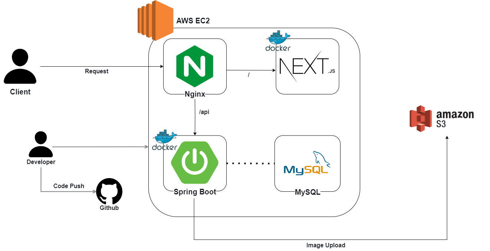
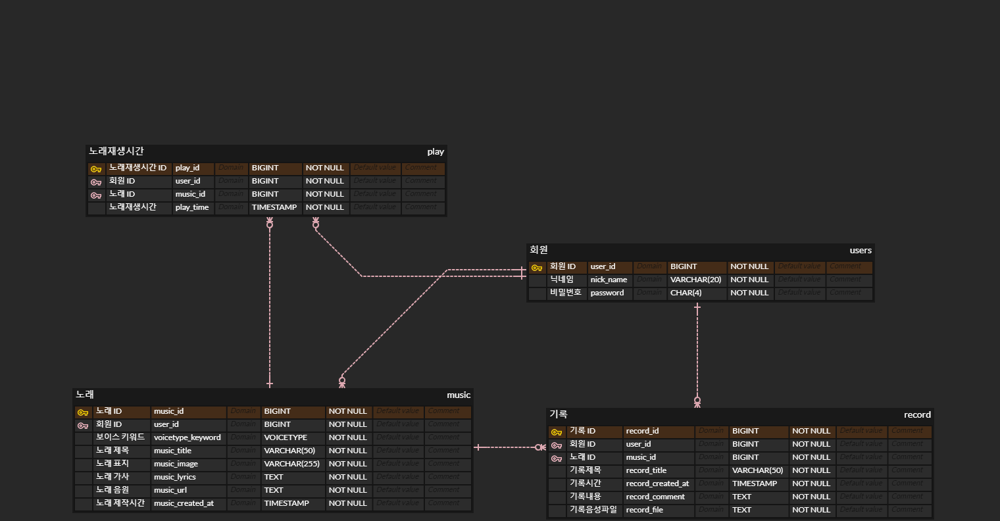

# HarMe(Harmony-Melodies) - 생성형 AI를 활용한 작곡 서비스


https://github.com/user-attachments/assets/ec7ac9de-3d87-4f96-bc89-a59ac0f62c24

# 📌 목차

- [README](#readme)

  - [🤔 기획 배경](#-기획-배경)
  - [💡 주요 기능](#-주요-기능)
  - [🚧 시스템 아키텍쳐](#-시스템-아키텍쳐)
  - [📝 설계 문서](#-설계-문서)
    - ERD
    - 기능 명세서
    - Swagger
  - [🛠 기술 스택](#-기술-스택)
  - [📂 파일 구조](#-파일-구조)
  - [🐰 팀원 소개](#-팀원-소개)

<br>
<br>

## 📅 프로젝트 진행 기간

| 프로젝트 진행 기간 | 2024.07.26 ~ 2024.08.02 (총 1주) |
| ------------------ | -------------------------------- |

<br><br>

## 🤔 기획 배경

- 음악이 우울증 해소에 긍정적 영향을 미친다는 연구를 바탕으로 노년층의 우울증 증가를 해결하기 위해 본 서비스를 기획<br>
- Google Cloud Platform, OpenAI, Suno AI를 활용하여 음성 인식, 가사 생성, 그림 생성, 노래 생성을 지원하는 서비스를 제공<br>
- 이를 통해 노년층의 정서적 안정, 사회적 연결, 인지 기능 향상, 자아실현을 도모하고자 함<br>
  <br><br>

## 💡 주요 기능

</img>
<br><br>

## 🎙️ 서비스 화면

#### 프롬프트 입력이 어려운 노인세대에게 음성명령을 통해 쉽게 음악을 생성하고 공유하는 경험을 제공

<br>

### 1. 작곡 기능

</img>
</img>
<br>

<!--
</img>
</img>
</img>
</img>
</img>  -->

### 2. 앨범 만들기

</img>
</img>
<br>

### 3. 기록 기능

</img>
</img>
<br>

## 🚧 시스템 아키텍쳐



<br>

## 🔗 설계 문서

### 🔗 [ERD]



### 🔗 [기능명세서](https://better-jumpsuit-1f8.notion.site/3eb7c54faee1405a9340949eeeacb4bb?pvs=4)

### 🔗 [Swagger](http://43.201.54.73:8081/swagger-ui/index.html)

<br>

## 🛠 기술 스택

### 🥕 Backend

-  : 17.0.9
-  : 3.3.2
-  : 8.0.34
  <br>

### 🥝 Frontend

-  : 14.2.5
-  : 18
  <br>

### 🫐 협업 툴

- 
- 
- 
  <br>

## 📂 파일 구조

<details  style="margin-left: 5px;">
<summary><b>BackEnd</b></summary>
<div>

```
📦harme
┣ 📂global
┃ ┣ 📂client
┃ ┃ ┗ 📜RestClientConfig
┃ ┣ 📂docs
┃ ┃ ┗ 📜SwaggerConfig
┃ ┣ 📂error
┃ ┃ ┣ 📂custom
┃ ┃ ┃ ┗ 📜RecordNotFoundException
┃ ┃ ┣ 📜ErrorCode
┃ ┃ ┗ 📜ErrorResponse
┃ ┣ 📂exception
┃ ┃ ┗ 📜GlobalExceptionHandler
┃ ┣ 📂s3
┃ ┃ ┣ 📜S3Config
┣ 📂image
┃ ┣ 📂controller
┃ ┃ ┗ 📜ImageController
┃ ┣ 📂dto
┃ ┃ ┣ 📜ImageRequestDto
┃ ┃ ┗ 📜ImageResponseDto
┃ ┣ 📂service
┃ ┃ ┗ 📜ImageController
┣ 📂music
┃ ┣ 📂controller
┃ ┃ ┣ 📜MusicController
┃ ┣ 📂dto
┃ ┃ ┣ 📜MainMusicResponseDto
┃ ┃ ┣ 📜MusicGenerateRequestDto
┃ ┃ ┣ 📜MusicGenerateResponseDto
┃ ┃ ┣ 📜MusicRequestDto
┃ ┃ ┣ 📜MusicResponseDto
┃ ┃ ┣ 📜Translate
┃ ┃ ┣ 📜TransRequestDto
┃ ┃ ┗ 📜TransResponseDto
┃ ┣ 📂entity
┃ ┃ ┗ 📜MusicEntity
┃ ┣ 📂repository
┃ ┃ ┗ 📜MusicsRepository
┃ ┣ 📂service
┃ ┃ ┗ 📜MusicService
┣ 📂mypage
┃ ┣ 📂controller
┃ ┃ ┗ 📜MypageController
┃ ┣ 📂dto
┃ ┃ ┣ 📜MypageRequestDto
┃ ┃ ┗ 📜MypageResponseDto
┃ ┣ 📂entity
┃ ┃ ┗ 📜PlayEntity
┃ ┣ 📂repository
┃ ┃ ┗ 📜MypageRepository
┃ ┣ 📂service
┃ ┃ ┗ 📜MypageService
┣ 📂record
┃ ┣ 📂controller
┃ ┃ ┗ 📜RecordController
┃ ┣ 📂dto
┃ ┃ ┣ 📜LatestRecordsAndMusicResponse
┃ ┃ ┣ 📜RecordDetailRequestDto
┃ ┃ ┣ 📜RecordDetailResponseDto
┃ ┃ ┣ 📜RecordMakingRequestDto
┃ ┃ ┣ 📜RecordRequestDto
┃ ┃ ┗ 📜RecordResponseDto
┃ ┣ 📂entity
┃ ┃ ┗ 📜RecordEntity
┃ ┣ 📂exception
┃ ┃ ┗ 📜RecordNotFoundException
┃ ┣ 📂repository
┃ ┃ ┗ 📜RecordRepository
┃ ┣ 📂service
┃ ┃ ┗ 📜RecordService
┣ 📂user
┃ ┣ 📂controller
┃ ┃ ┣ 📜UserController
┃ ┣ 📂dto
┃ ┃ ┣ 📜UserRequestDto
┃ ┃ ┗ 📜UserResponseDto
┃ ┣ 📂entity
┃ ┃ ┗ 📜UserEntity
┃ ┣ 📂repository
┃ ┃ ┗ 📜UserRepository
┃ ┣ 📂service
┃ ┃ ┗ 📜UserService
┗ 📜HarmeApplication
```

</div>
</details>

<br>
<details  style="margin-left: 5px;">
<summary><b>FrontEnd</b></summary>
<div>

```
📦allclear
┣ 📂public
┃ ┣ 📂chat-icons
┃ ┣ 📂create-cover-icons
┃ ┗ 📂player-icons
┣ 📂src
┃ ┣ 📂app
┃ ┣ 📂atoms
┃ ┣ 📂components
┃ ┣ 📂hooks
┃ ┣ 📂libs
┃ ┣ 📂mocks
┃ ┣ 📂types
┣ 📜.eslintrc.cjs
┣ 📜.gitignore
┣ 📜.prettierrc
┣ 📜components.json
┣ 📜next.config.mjs
┣ 📜package.json
┣ 📜pnpm-lock.yaml
┣ 📜postcss.config.mjs
┣ 📜README.md
┣ 📜tailwind.config.js
┗ 📜tsconfig.json
```

</div>
</details>
<br>

## 🐰 팀 구성

| 이름   | 역할                 |
| ------ | -------------------- |
| 김민태 | - Leader, AI <br>    |
| 석지원 | - UI/UX <br>         |
| 오승태 | - FE <br>            |
| 김현진 | - BE <br>            |
| 이대영 | - BE, AI, Infra <br> |

<br>
